# Vibe Coding: Provider and Model Configuration Guide

This document explains how to add providers, configure authentication keys for existing providers, and manage multiple models per provider. Access to these configuration settings is restricted to users with administrator privileges.

## Step 1: Access Settings

Go to the default UI page and click **Settings**.

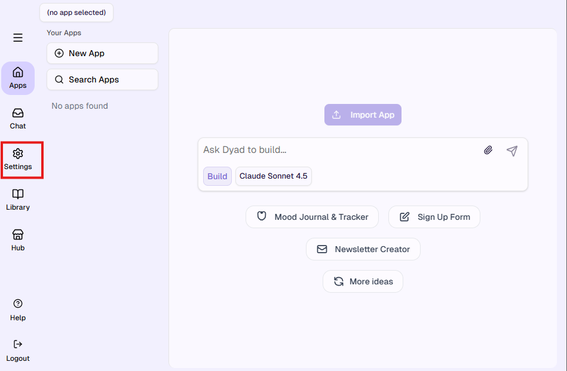

## Step 2: Navigate to Model Providers

Click on **Model Providers**.

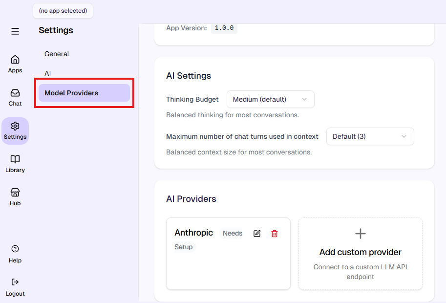

## Step 3: View Default Provider

In the **Model Providers** section, you will see the default provider, **Anthropic**, along with an option to add custom providers.

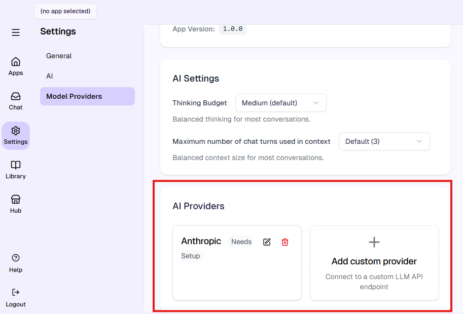

## Step 4: Add a Custom Provider

To add a custom provider, click the **Add Custom Provider** option. You will be prompted to enter the required provider details.

The following examples illustrate the expected input format for a provider:

- **Provider Name:** Google
- **API Base URL:** https://generativelanguage.googleapis.com/v1
- Then click on **Add Provider**

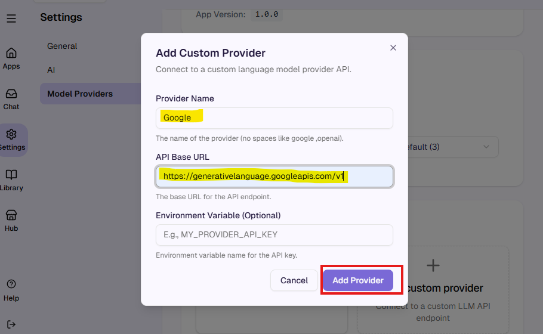

## Step 5: View Added Provider

Once added, the new provider will be displayed in the **Model Providers** section, alongside the default **Anthropic** entry.

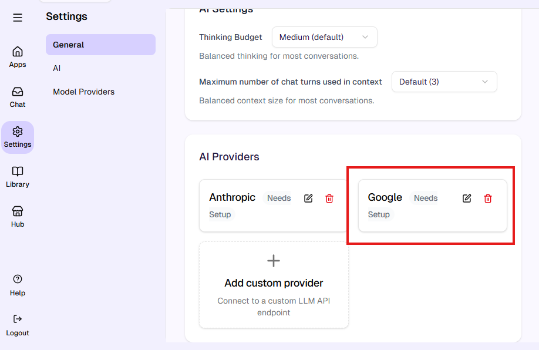

## Step 6: Manage API Keys

To manage API keys for a provider, click on any existing provider from the list. You will be redirected to the configuration page, where you can add, update, or remove the API key as needed.

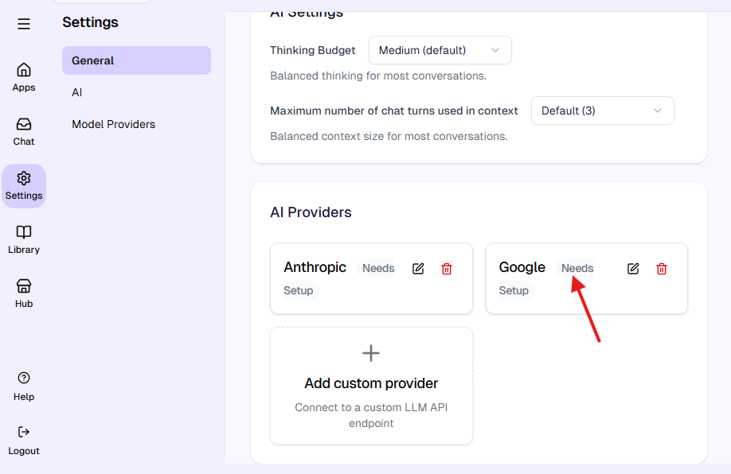

## Step 7: Configure API Key

After selecting a provider, the configuration page will appear. Enter your API key and click **Save** to store the key for that provider.

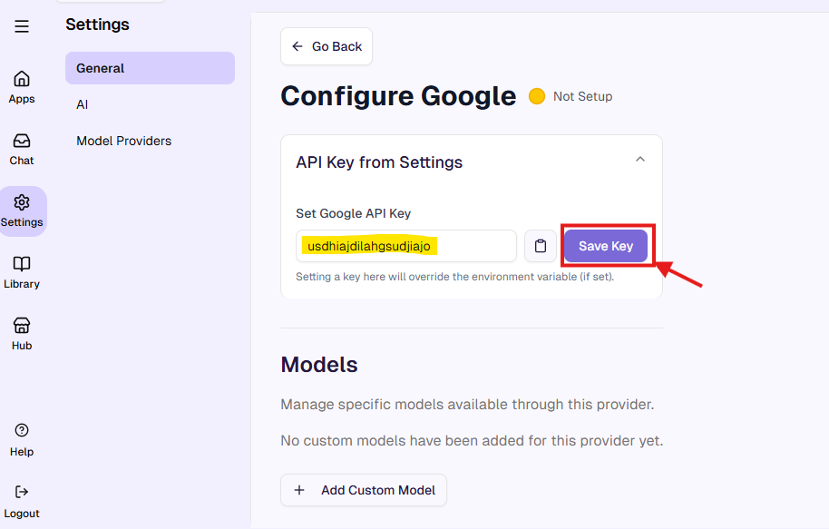

## Step 8: Verify Provider Status

Once the API key is configured, the UI will reflect the updated state. In the **Model Providers** page, the provider status will change from **Needs Setup** to **Ready**.

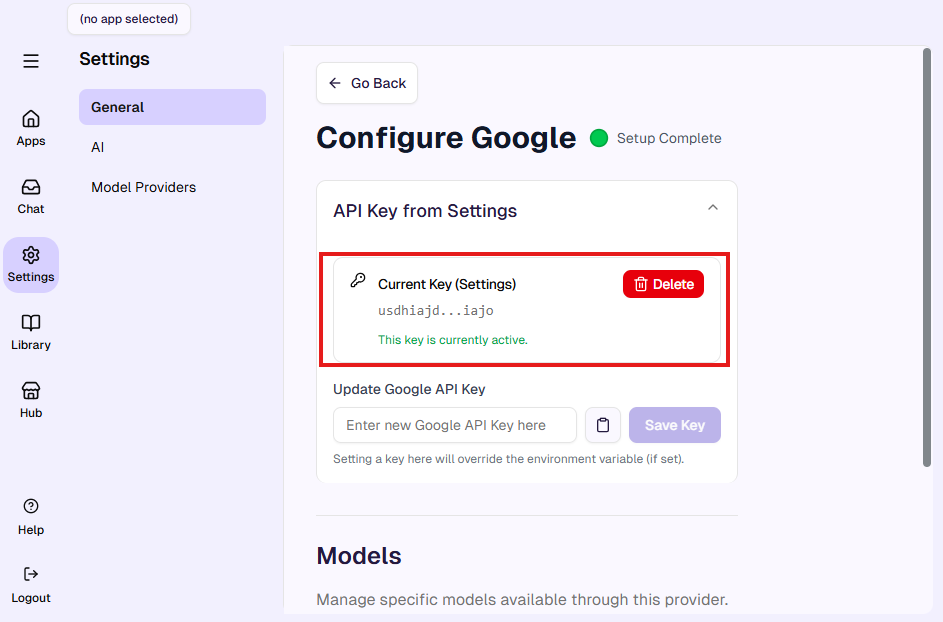

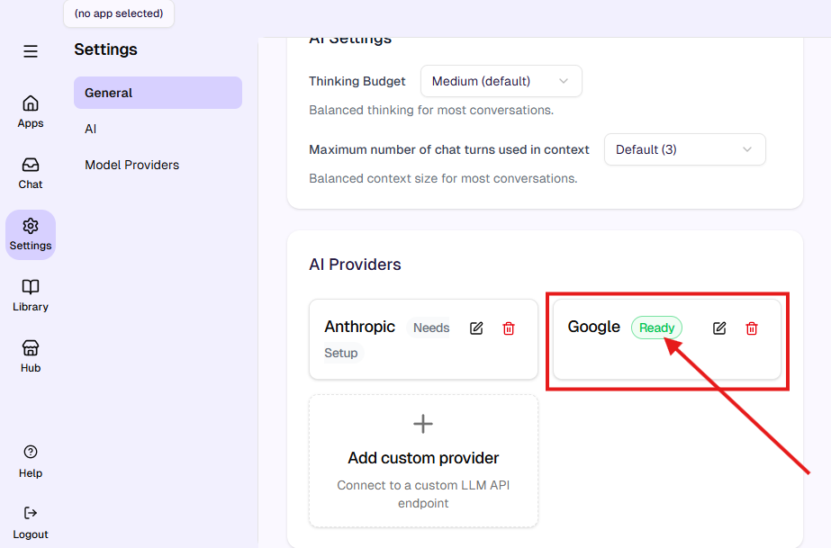

## Step 9: Add a Custom Model

To add a model for a specific provider, go to **Model Providers** and select the provider you want to configure. Then click **Add Custom Model** to enter the model details.

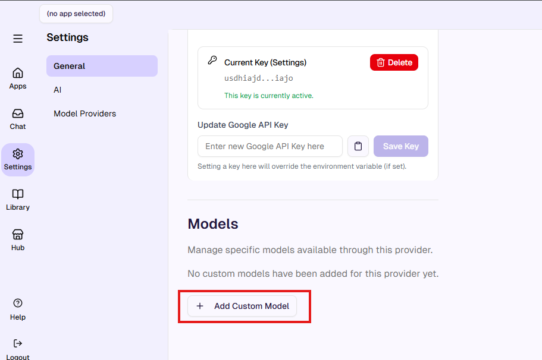

## Step 10: Provide Model Details

Provide the following details:

- **Model ID:** gemini-2.5-flash
- **Name:** Gemini 2.5 Flash

Then click **Add Model** to save the configuration.

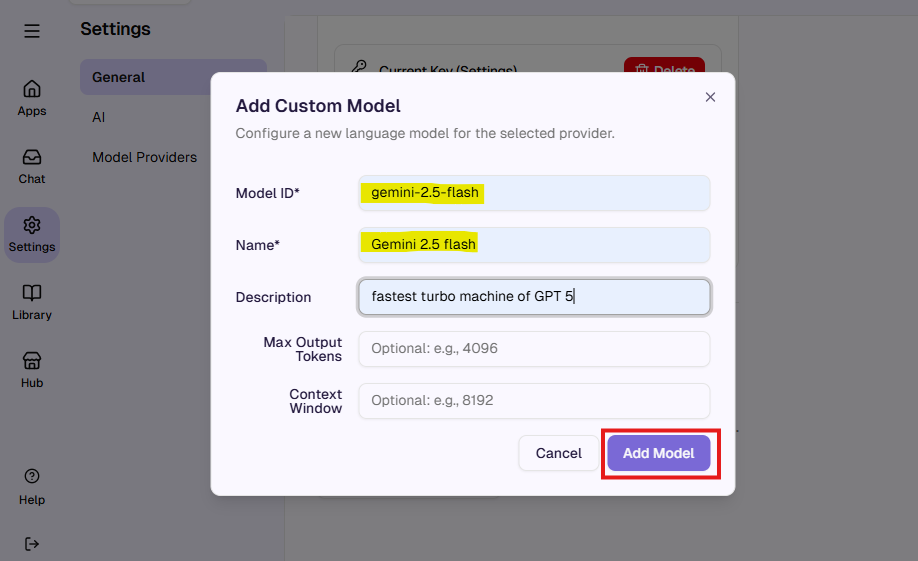

## Step 11: View Added Model

The newly added model will now appear in the **Model List**. You can add multiple models for a single provider.

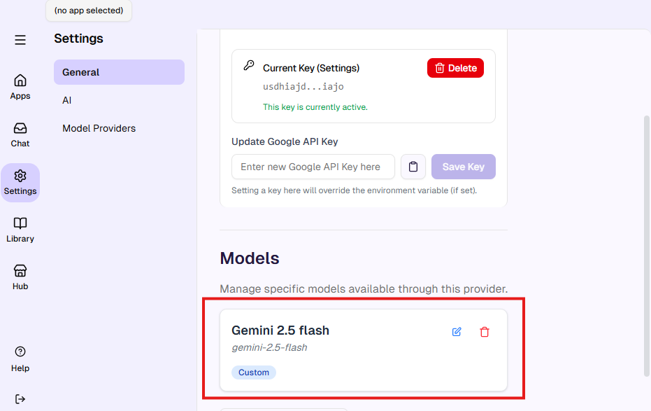

## Step 12: Use Configured Models

After completing the provider and model configurations, the user will be able to select a specific model from the available list to generate code accordingly.

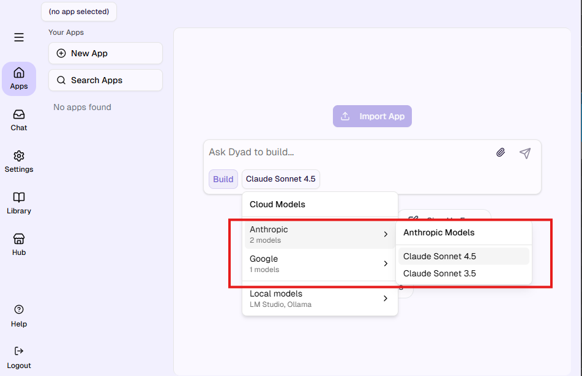

## Step 13: Access Control

Only users with administrator access can view and modify these configuration settings. Regular users will not see the **Model Providers** option in the Settings menu.

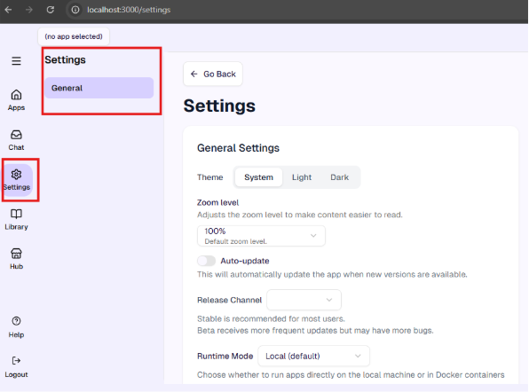
