# GitHub Integration Flow

This document provides an overview of how to link an application to a GitHub repository and publish local updates to the remote repository.

## Step 1: Publish Generated Code

After generating the code, the interface will display a **Publish** option for pushing the code to GitHub. Select **Publish** to initiate the upload process.

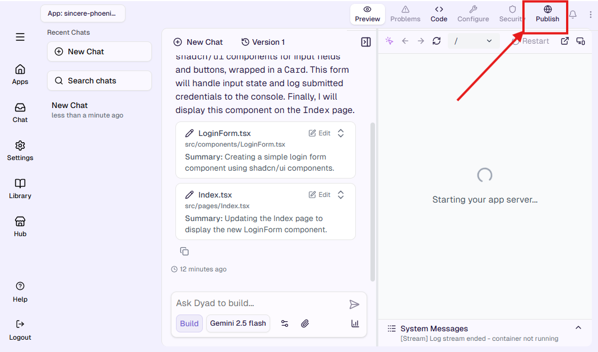

## Step 2: Connect to GitHub

When you click **Publish** and there is no active GitHub connection, the UI will display a **Connect to GitHub** button. Click **Connect to GitHub** to initiate the connection process.

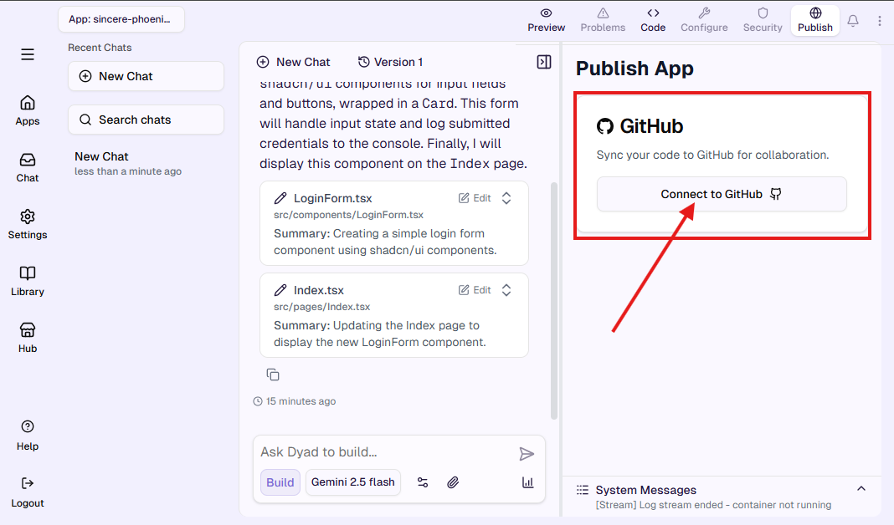

## Step 3: Authorization Code and External Link

When you select **Connect to GitHub**, the system generates an external authorization link along with a verification code. Copy the code and navigate to the external URL to complete the authorization process.

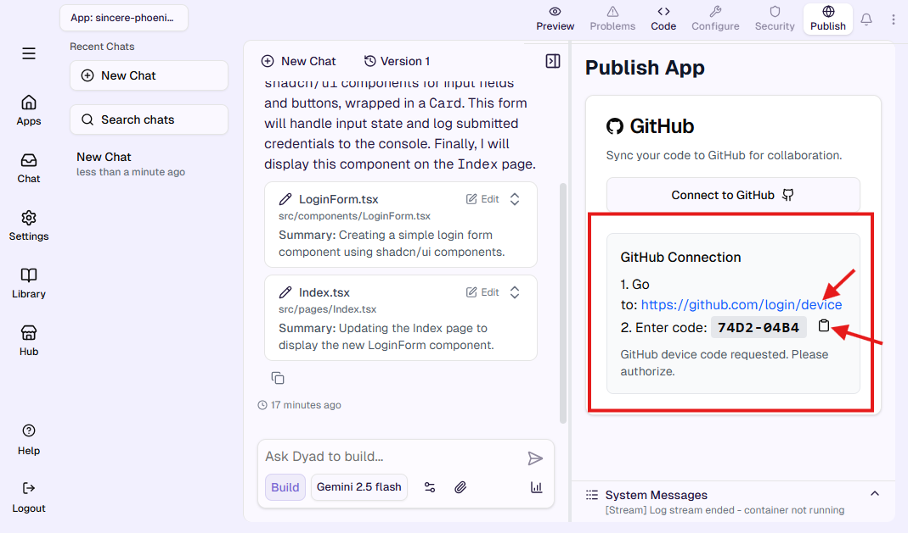

## Step 4: Create or Connect to Repository

After the authorization is complete, you will be presented with two options: **Create Repository** or **Connect to Existing Repository**. When creating a new repository, the system will prefill the repository name with the application name and set the default branch to **main**. You may update both values as needed, then click on **Create Repo**.

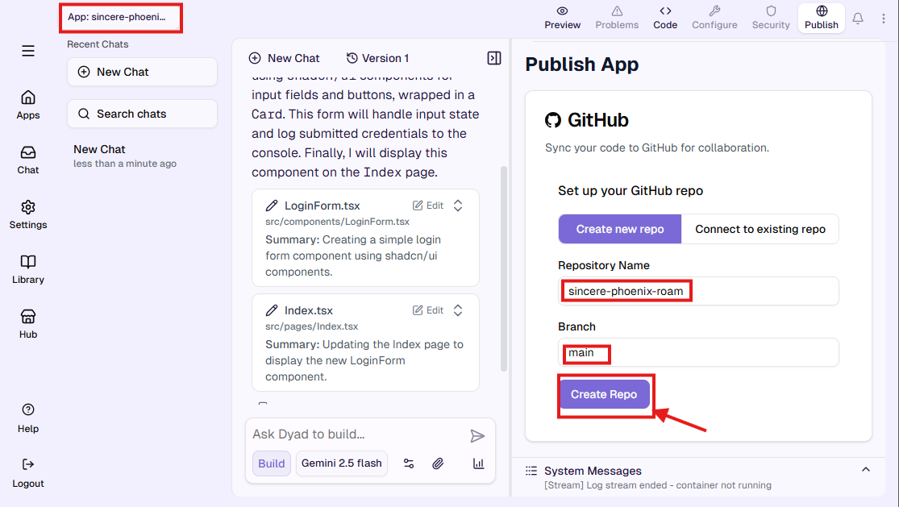

## Step 5: Code Pushed to GitHub

Once you select **Create Repo**, the application automatically pushes the generated code to GitHub. The **Publish** panel will then display the linked repository and the branch currently in use.

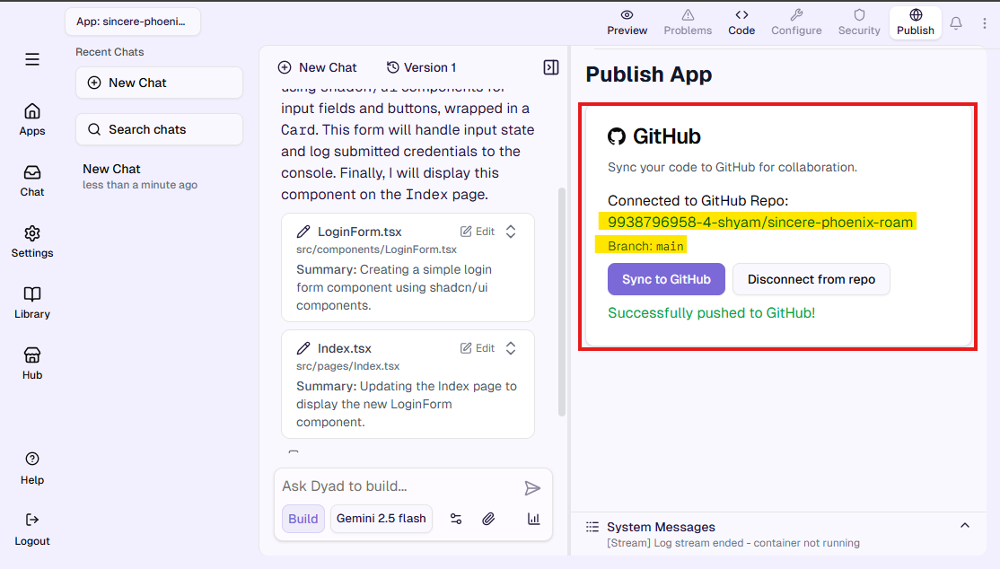

## Step 6: Sync New Changes

When additional prompts generate new or updated files, you can push these changes to the connected repository by clicking the **Sync** option.

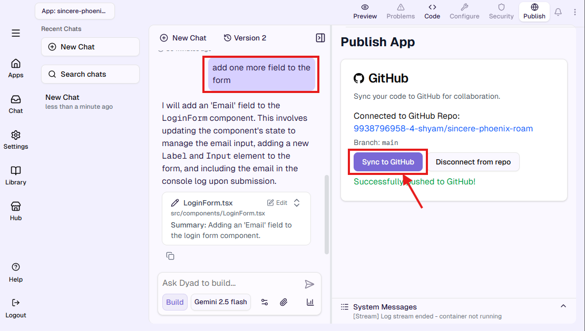

## Step 7: Active GitHub Connection with New App

When creating a new app while a GitHub connection is already active, the system skips the connection setup step. In the **Publish** panel, you will directly see the options to **Create Repo** or **Connect to Existing Repo**, without needing to authorize GitHub again.

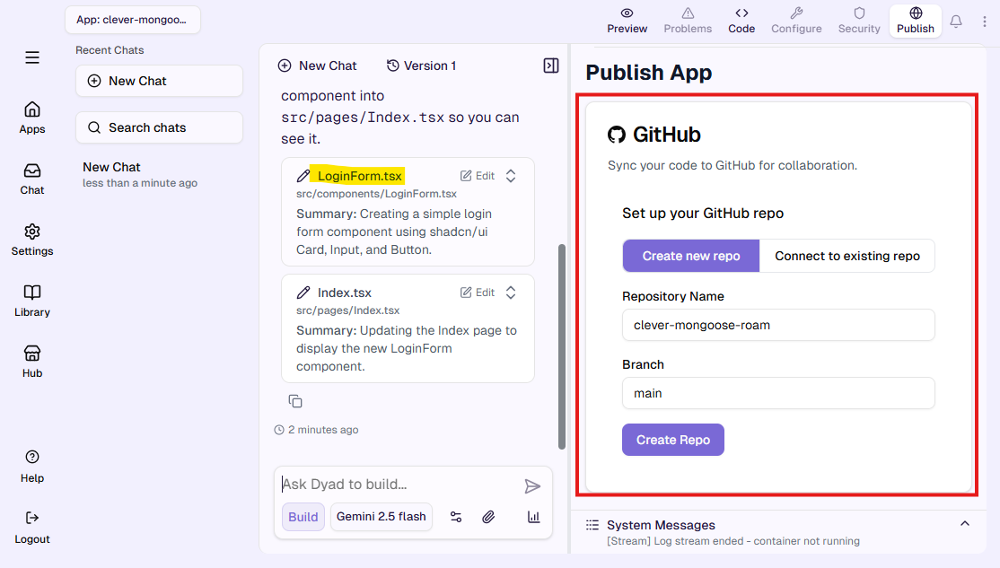

## Step 8: Connect to Existing Repository

Upon selecting **Connect to Existing Repo**, the system will populate the **Select Repository** dropdown with all repositories associated with your GitHub account, as well as their corresponding branches. Choose the appropriate repository and branch to complete the connection process and click on **Connect to Repo**.

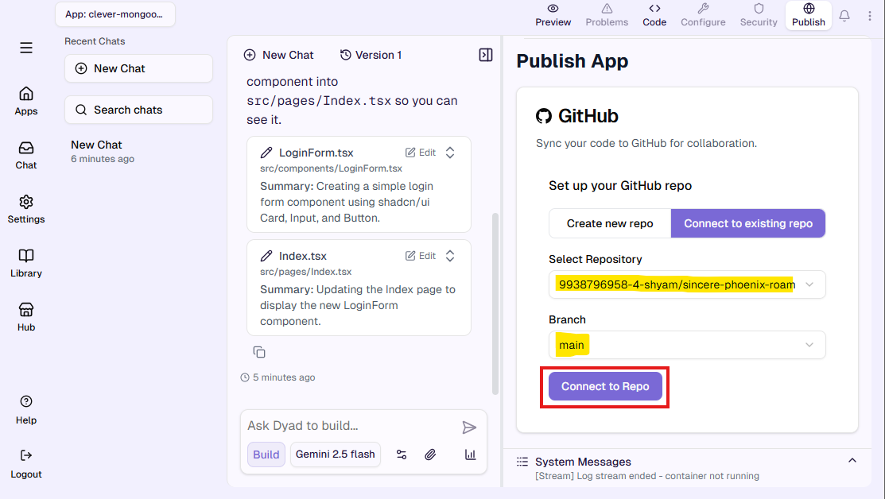

## Step 9: Force Push if Needed

Once you select **Connect**, the system compares the current project files with the contents of the target repository. If they do not match, you will be prompted for a **Force Push**, as a standard fast-forward push is not possible. Select **Force Push** to replace the repository's existing code with the newly generated version.

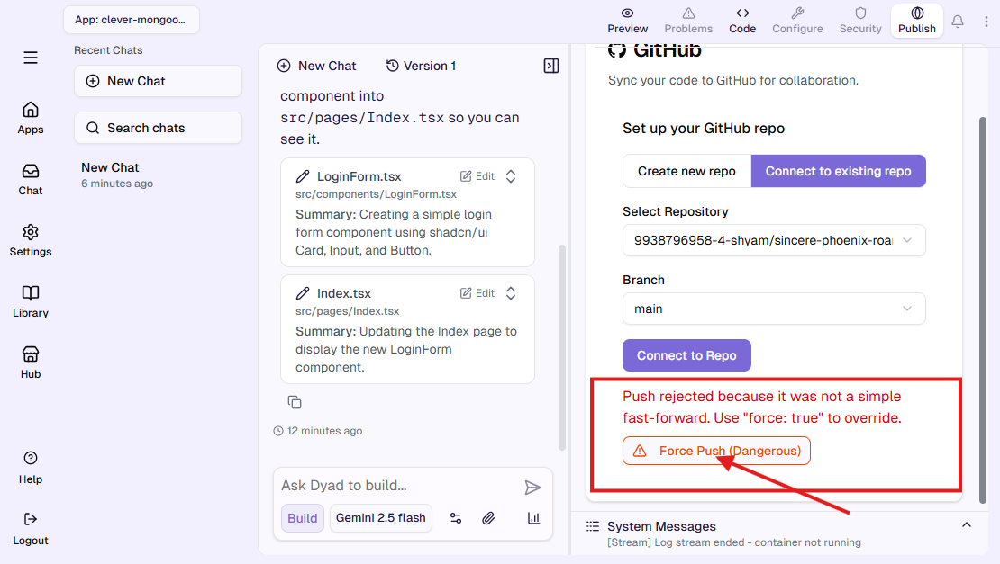

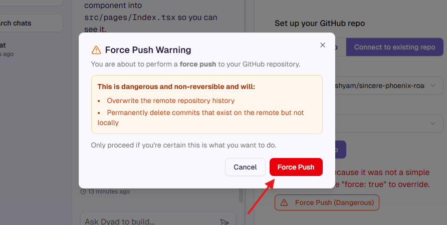

## Step 10: Disconnect from GitHub

To remove an existing GitHub integration, navigate to any application and open the **Publish** section. When an active connection is present, it will be shown as **Connected to GitHub Repo**. Select **Disconnect from Repo** to terminate the current GitHub connection and again it will ask us to go through the authorization process of **Connect to GitHub**.

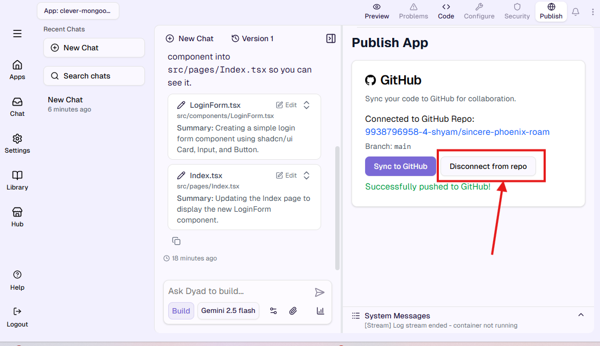

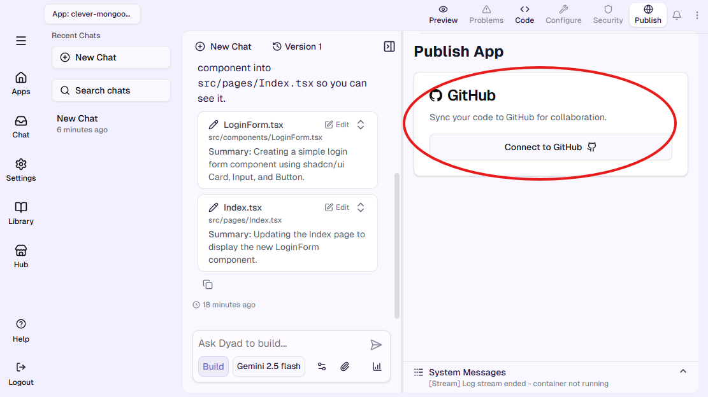

## Step 11: GitHub Operations from Apps Section

GitHub operations are not limited to the **Publish** section. By navigating to **Apps** and selecting an existing application, you will find the same GitHub integration options, allowing you to perform all required actions directly from the app's details page.

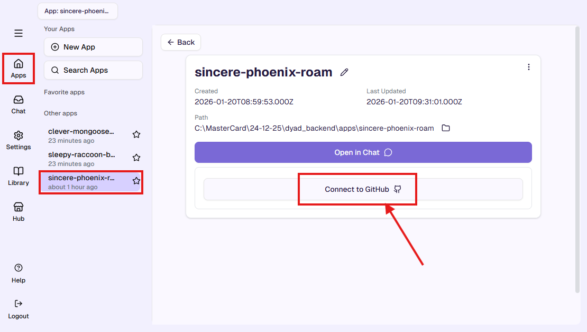
