# Keycloak Configuration Documentation

Keycloak must be configured through the `.env` file. This guide outlines where to locate each required Keycloak parameter and how to apply them in your environment configuration.

## Step 1: Environment Variables

Below are the data we need in `.env` file:

```
KEYCLOAK_URL=http://localhost:8080/
KEYCLOAK_REALM=dyad-web
KEYCLOAK_CLIENT_ID=dyad-backend
KEYCLOAK_CLIENT_SECRET=2FHnvEuukzI2txq3HV2LxCtE4aiyyIpU
KEYCLOAK_REDIRECT_URI=http://localhost:3001/api/auth/callback
```

## Step 2: Create Realm

To create a realm (KEYCLOAK_REALM=dyad-web), click on **Create Realm** in the UI.

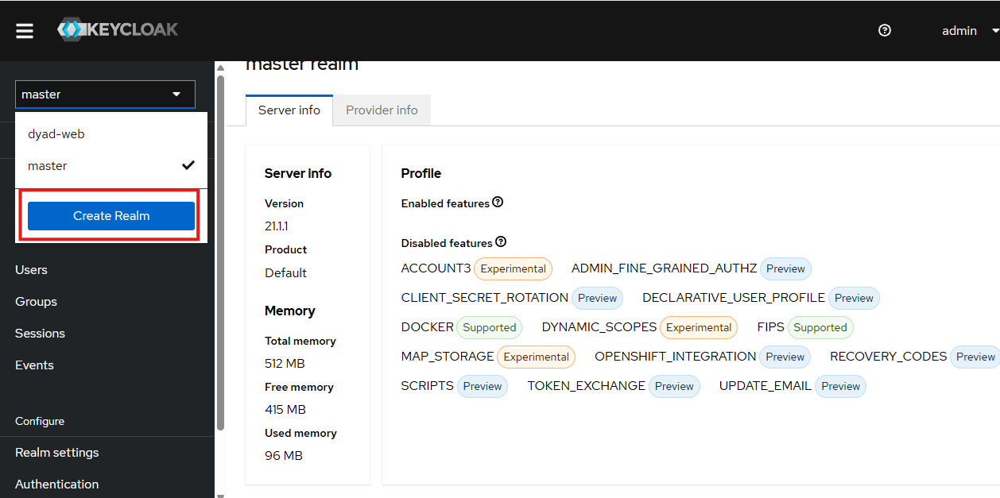

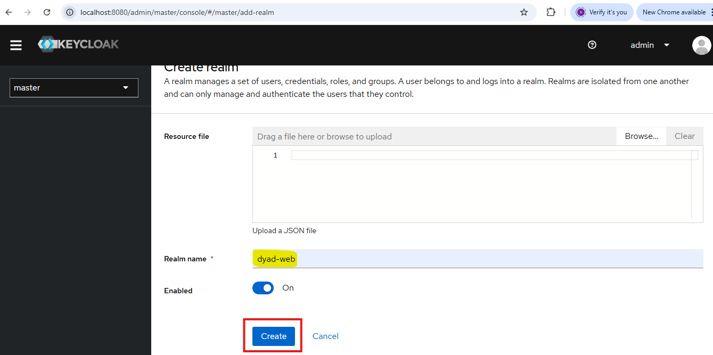

## Step 3: Select Realm and Navigate to Clients

After creating the realm, select that realm and click on **Clients**.

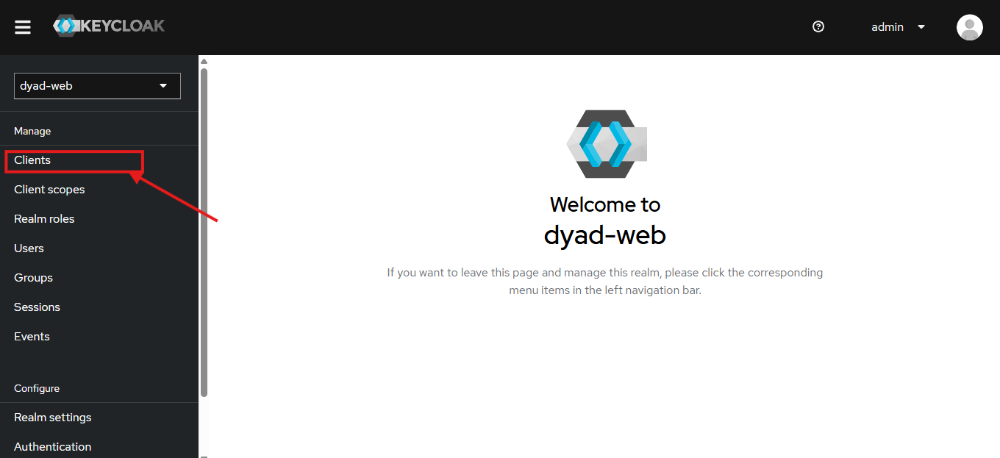

## Step 4: Create a New Client

Then click on **Create Client**.

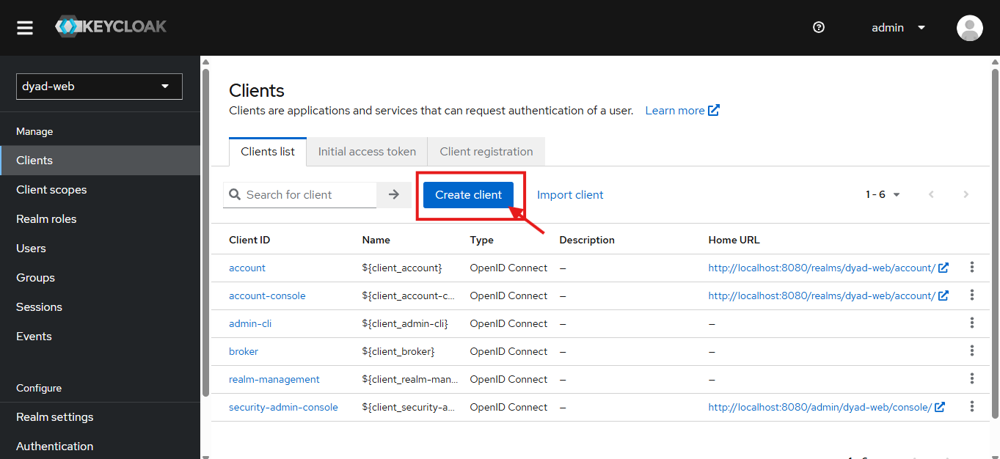

## Step 5: Provide Client Details

Provide the **Client Id** and **Name**, then click on **Next**.

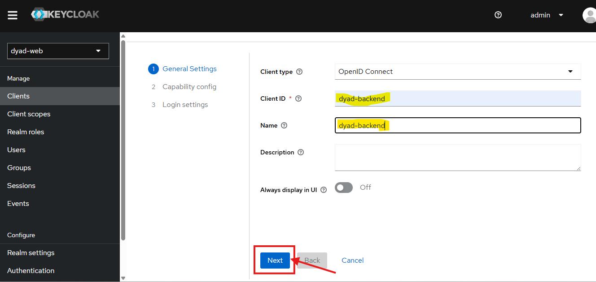

## Step 6: Configure Client Authentication

In **Capability config**, **Client authentication** should be enabled, then click on **Next**.

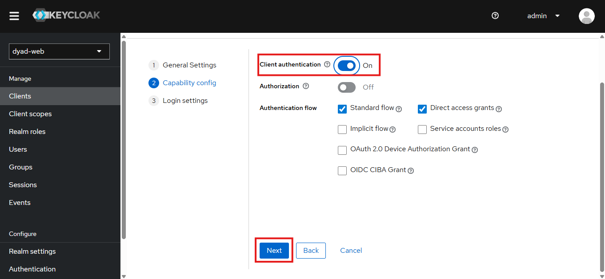

## Step 7: Configure Login Settings

Now in **Login settings**, provide the URLs as shown in the image, and click on **Save**.

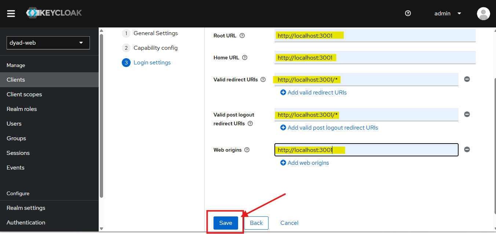

## Step 8: Access Credentials Section

Once you select **Save**, the client configuration page will appear. From there, click on the **Credentials** section to view the client secret and related settings.

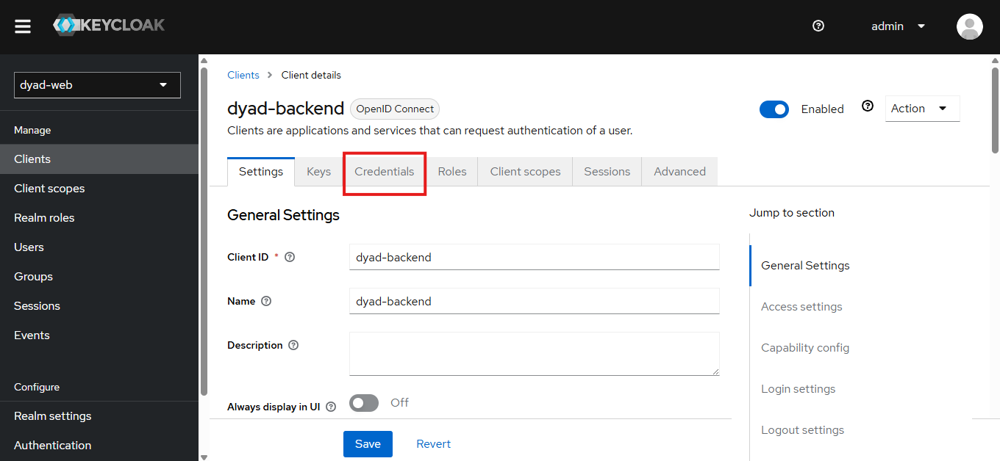

## Step 9: Copy Client Secret

After opening the **Credentials** tab, you will see the **Client Secret** field. Copy the client secret and paste it into the corresponding entry in your `.env` file.

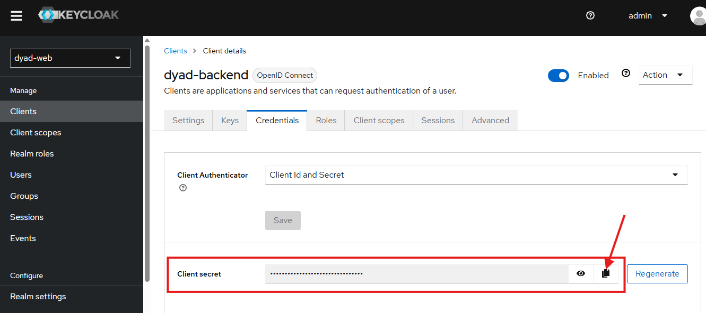

## Step 10: Create a New User

Now to create a user, click on **Users** then click on **Create new user**.

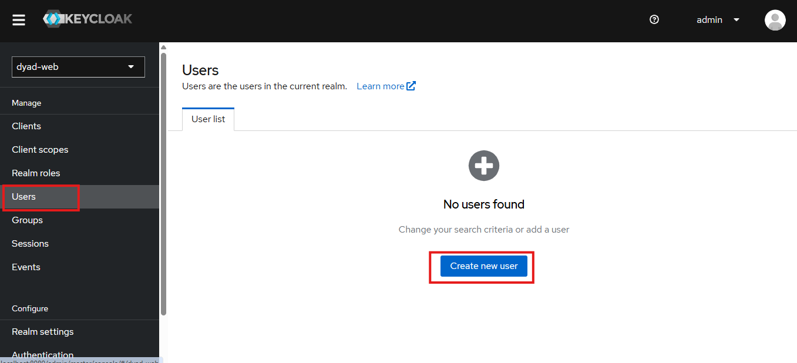

## Step 11: Fill User Details

After clicking **Create New User**, fill in the required user details. Ensure that **Email Verified** is set to **Disabled**, then click **Create**.

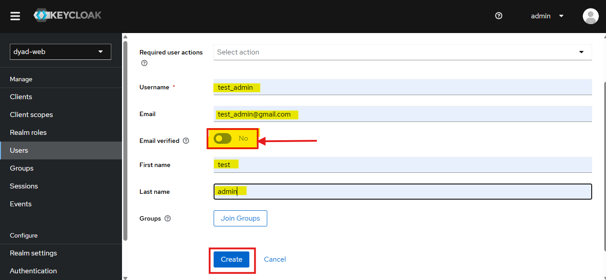

## Step 12: Set User Password

Once the user is created, navigate to the **Credentials** section. From there, select **Set Password** to define the user's login credentials.

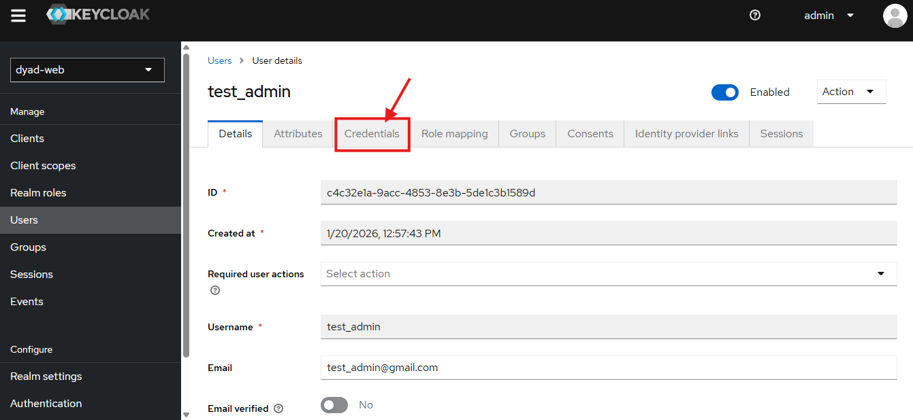

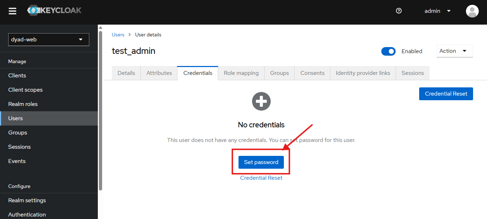

## Step 13: Configure Password Settings

After providing the password, make the **Temporary** field as **off** and click on **Save**.

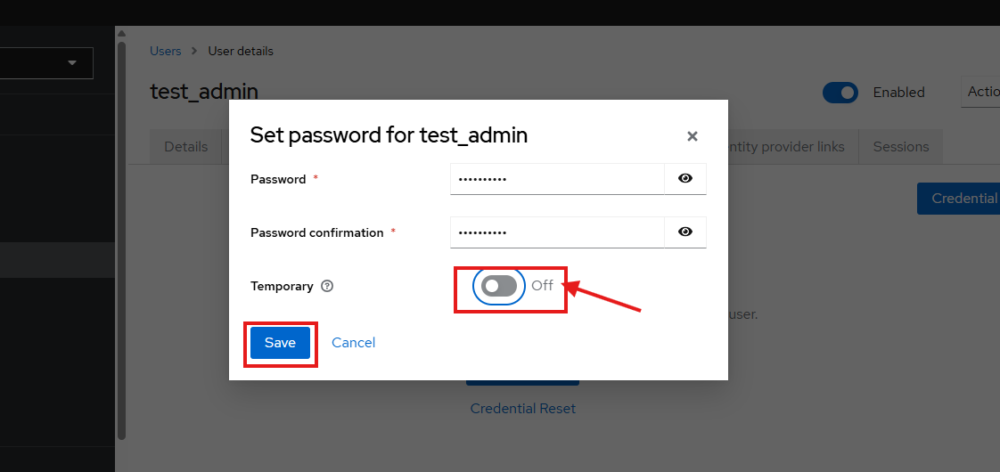

## Step 14: Create Admin Role

Before granting administrative privileges, an admin role must be created. Go to the **Realm Roles** section and select **Create Role**.

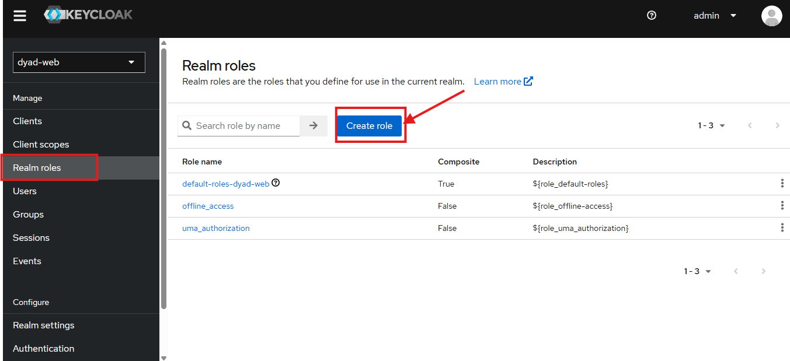

## Step 15: Configure Admin Role Details

Now provide the **Role name** as **admin** and **description** as **${role_admin}** and click on **Save**.

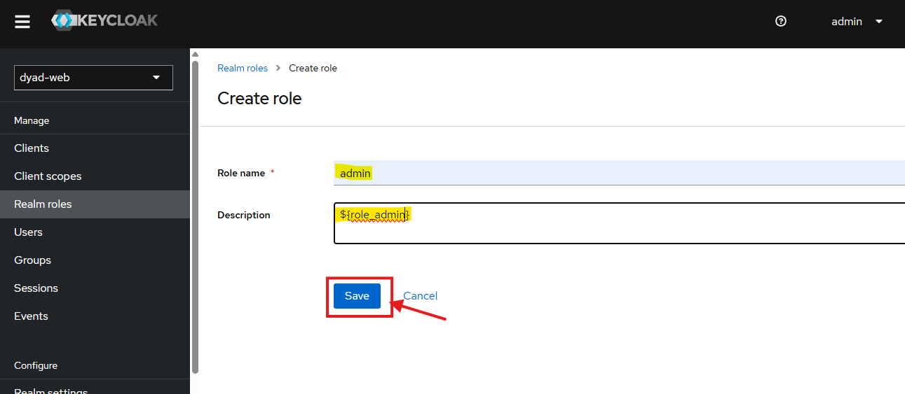

## Step 16: Assign Admin Role to User

Once the admin role has been created, proceed to assign it to the appropriate user. Open the **Users** section, choose the specific user, and navigate to **Role Mapping**. Select **Assign Role**, choose the admin role that was created, and click **Assign** to finalize the assignment.

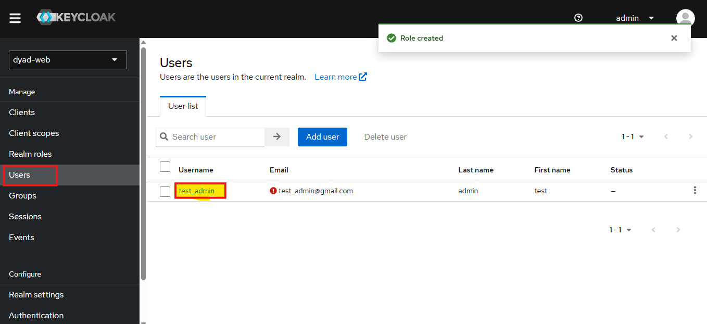

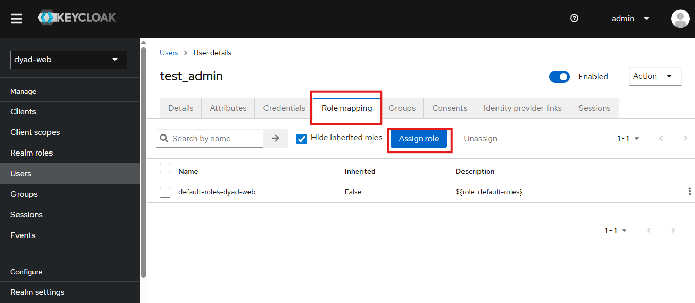

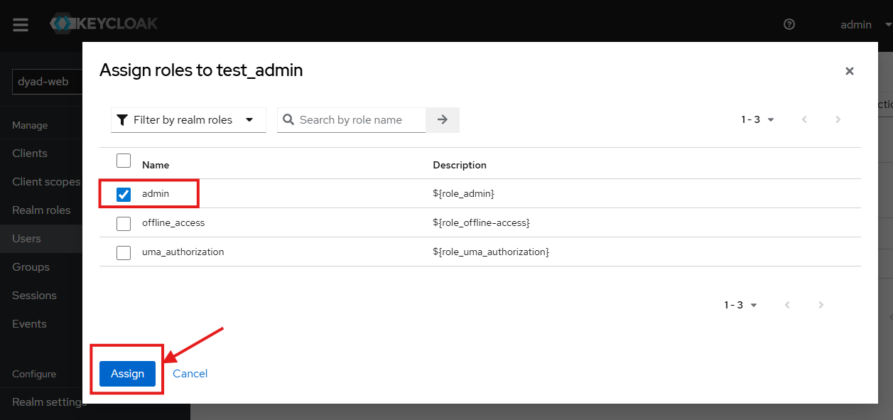

## Step 17: Regular User Configuration

No role assignment is needed for regular users. Keycloak automatically treats them as default users unless additional roles are explicitly assigned.

